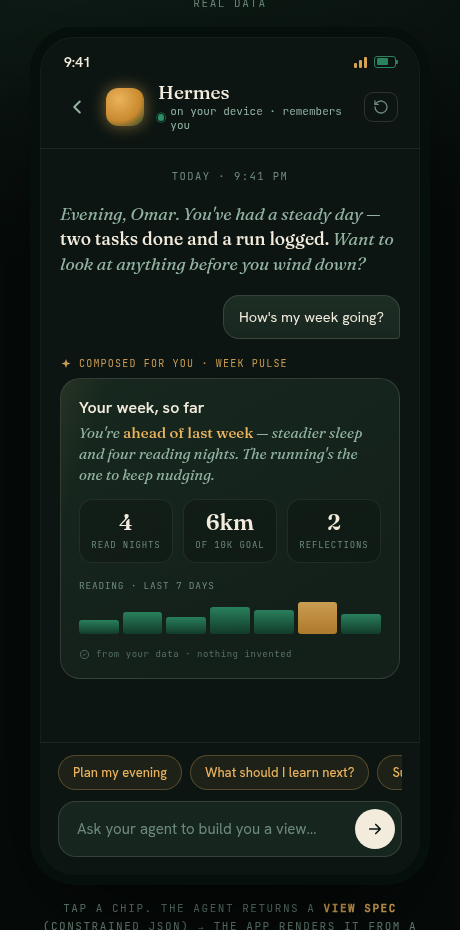
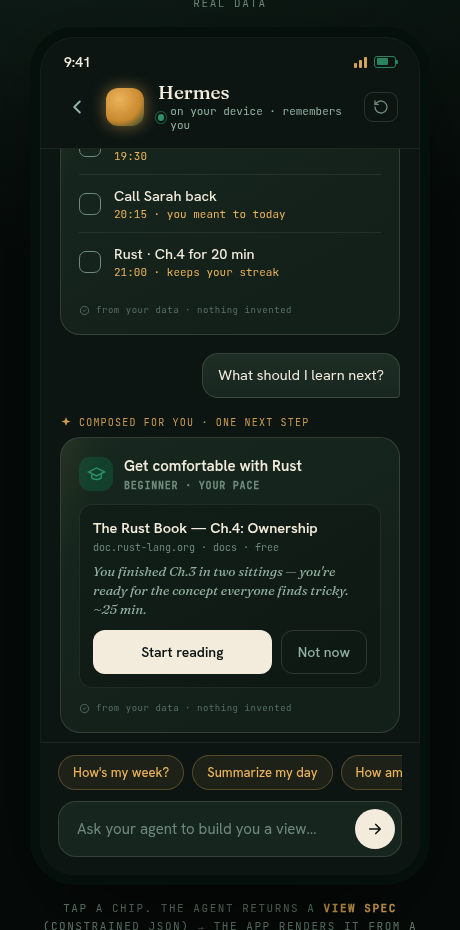

# Generative UI — the agent composes the view

*Status: **design + prototype only.** This document specs a direction the user
loves; no production app code has changed. The working, self-contained prototype
lives at [`docs/genui/prototype.html`](genui/prototype.html) (open it in a
browser); rendered stills are at
[`docs/genui/still-week-pulse.png`](genui/still-week-pulse.png) and
[`docs/genui/still-plan-and-learning.png`](genui/still-plan-and-learning.png).
This is the plan for turning it into real Compose/SwiftUI against a user-owned
Hermes.*




---

## The idea in one paragraph

Instead of a fixed dashboard of pre-built screens, the Life Agent becomes a
**conversational surface that composes a bespoke view on demand**. The user asks
("how's my week?", "plan my evening", "what should I learn next?"); the agent
picks a view from a **fixed library of primitives** and fills its data slots from
the user's own data; the composed view appears inline in the chat. A **fixed
shell** never changes: the header (agent name + on-device *"remembers you"*
status), the suggestion chips, and the composer. The view is not free-form HTML
from a model — it is a **constrained JSON "view spec"** the client renders with
its own trusted, native components.

## The one rule that makes this safe: the model returns a *spec*, not markup

The agent **never** returns HTML, markdown-to-render, SwiftUI, or Compose. It
returns a small, strict JSON object naming an allowed primitive and its data.
The client validates that JSON against a fixed schema and renders it with native
components it already owns. If the JSON names a primitive we don't know, or a
field is missing/oversized/wrong-typed, that primitive is dropped — never
rendered as raw text, never executed.

This is the **exact pattern already shipping** in this codebase:

- **Knowledge graph** — `KnowledgeGraphExtractor.buildExtractionPrompt` asks
  Hermes for strict `{nodes,edges}` JSON and `parse()` reads it back leniently,
  dropping anything malformed
  ([`KnowledgeGraphExtractor.kt`](../shared/src/commonMain/kotlin/com/personalagent/shared/knowledge/KnowledgeGraphExtractor.kt)).
- **Learning recommendations** — `LearningRecommendationParser` parses a strict
  JSON array of web resources, sanitizing every field as **inert display data**
  ([`LearningRecommendationParser.kt`](../shared/src/commonMain/kotlin/com/personalagent/shared/learning/LearningRecommendationParser.kt)).

Generative UI is the same move applied to *layout*: structured extraction →
lenient parse → native render. Nothing new or riskier than what already ships.

### Why not "let the model write the UI"

| Approach | Injection surface | Consistency | Offline | Verdict |
|---|---|---|---|---|
| Model returns HTML/markup | **High** — arbitrary DOM, links, scripts | Drifts per reply | No | ✗ rejected |
| Model returns a component DSL we `eval` | Medium — still model-controlled control flow | Medium | No | ✗ rejected |
| **Model returns a constrained view spec; client renders from a fixed library** | **None** — data can't become code | Native, pixel-consistent | Degrades cleanly | ✓ **chosen** |

A leaked or malicious Hermes reply can, at worst, put wrong *text/numbers* into a
known card shape — the same trust boundary chat already has. It can never inject
markup, launch a scheme, or change control flow.

---

## The fixed shell (never composed by the model)

The shell is ordinary native UI. Only the middle "views" region is generative.

```
┌─────────────────────────────────────┐
│  ● Hermes                            │  ← header: name + "on your device ·
│  on your device · remembers you      │     remembers you" (connection state)
├─────────────────────────────────────┤
│                                      │
│   agent prose line                   │
│   ┌───────────────────────────────┐  │  ← CONVERSATION (scrolls)
│   │  composed view (a primitive)  │  │     agent prose + user bubbles +
│   └───────────────────────────────┘  │     composed views, interleaved
│                          user bubble │
│   ⟨ composing your view… ⟩            │  ← transient "composing" state
│                                      │
├─────────────────────────────────────┤
│  [Plan my evening] [Learn next?] …   │  ← FIXED suggestion chips
│  ┌─────────────────────────┐  ( → )  │  ← composer (text + send)
│  └─────────────────────────┘         │
└─────────────────────────────────────┘
```

- **Header** — agent name, avatar, and a live status string driven by
  `HermesConfigStore` connection state (*"on your device · remembers you"* when a
  Hermes is configured and reachable). Never model-controlled.
- **Suggestion chips** — a **fixed, curated set** the app ships (see below). They
  are shortcuts to the same prompts the user could type; they are *not* generated
  by the model, so they can't be spoofed and are testable/localizable.
- **Composer** — free text. Anything typed becomes a normal chat turn that may or
  may not resolve to a composed view.

### Fixed suggestion chips (v1)

Curated in `:shared` so Android and iOS share exact copy (like
`LearningStatusText.TAP_OPTIONS`). Each maps to a canonical prompt and a
*preferred* primitive (a hint, not a guarantee — the agent still chooses):

| Chip label | Canonical prompt | Preferred view |
|---|---|---|
| How's my week? | "How's my week going?" | `week-pulse` |
| Plan my evening | "Plan my evening" | `plan` |
| What should I learn next? | "What should I learn next?" | `resource-rec` |
| Summarize my day | "Summarize my day" | `day-recap` |
| How am I doing on my goals? | "How am I doing on my goals?" | `stat-grid` |

Chips are shown when relevant and consumed on tap (as in the prototype). The set
is small and honest: every chip only surfaces data the app actually has.

---

## The view-spec contract

One composed view = one `ViewSpec`: an ordered list of **blocks**, each a known
primitive with a typed payload. The whole reply is a single JSON object.

```jsonc
{
  "view": "week-pulse",            // semantic name of the composition (for the eyebrow + analytics)
  "title": "Your week, so far",    // optional short heading, sanitized text
  "blocks": [                       // ordered list of primitives to stack
    { "type": "prose-line", "text": "You're ahead of last week — steadier sleep and four reading nights." },
    { "type": "stat-grid", "stats": [
        { "value": "4",   "label": "read nights" },
        { "value": "6km", "label": "of 10k goal" },
        { "value": "2",   "label": "reflections" }
    ] },
    { "type": "sparkline", "caption": "reading, last 7 days",
      "points": [40,65,50,80,70,95,60], "highlightIndex": 5 }
  ]
}
```

The client parses this into a `ViewSpec` domain object, **validates every block**,
drops unknown/invalid blocks, and renders each surviving block with its native
composable/SwiftUI view. An empty result → graceful fallback (below).

### Global envelope

| Field | Type | Rule |
|---|---|---|
| `view` | string | one of the known view names; used for the *"composed for you · <view>"* eyebrow and analytics only. Unknown → generic eyebrow. |
| `title` | string? | ≤ 60 chars, sanitized (control chars stripped, whitespace collapsed). |
| `blocks` | array | 1–8 blocks. More are truncated (and the truncation is logged, per the no-silent-caps rule). Empty → fallback. |

---

## v1 primitive set

Each primitive has a **fixed data schema**; the client owns the rendering. Text
fields are always sanitized like `LearningRecommendationParser` does (strip
control chars, collapse whitespace, cap length) and treated as inert display
data. Numbers are the **only** thing the model supplies as numbers, and see the
honesty rule below for where those numbers must come from.

### 1. `prose-line` — one warm sentence

The agent's voice, in serif italic. The connective tissue between cards.

```jsonc
{ "type": "prose-line", "text": "A quietly productive Saturday.", "emphasis": ["quietly productive"] }
```

| Field | Type | Rule |
|---|---|---|
| `text` | string | ≤ 200 chars, sanitized. |
| `emphasis` | string[]? | ≤ 3 substrings of `text` to render in the accent color. Non-matching entries ignored. |

### 2. `stat-grid` — 2–4 headline numbers

Grid of big-number / small-label tiles. The recap/week-pulse workhorse.

```jsonc
{ "type": "stat-grid", "stats": [ { "value": "2", "label": "tasks done" }, … ] }
```

| Field | Type | Rule |
|---|---|---|
| `stats` | array | 2–4 items. |
| `stats[].value` | string | ≤ 8 chars (e.g. `"6km"`, `"20m"`, `"2"`). Rendered verbatim — **must be a real count** (see honesty). |
| `stats[].label` | string | ≤ 24 chars, sanitized. |

### 3. `sparkline` — a 7-ish point trend

Bar sparkline for a single metric over time. Bars are normalized client-side.

```jsonc
{ "type": "sparkline", "caption": "reading, last 7 days", "points": [40,65,50,80,70,95,60], "highlightIndex": 5 }
```

| Field | Type | Rule |
|---|---|---|
| `points` | number[] | 3–14 non-negative numbers; client normalizes to the tallest. |
| `caption` | string? | ≤ 40 chars. |
| `highlightIndex` | int? | which bar to accent (e.g. today). Out-of-range ignored. |

### 4. `plan` (checklist) — an ordered, tickable list

Interleaved tasks/agenda. Each row can carry a time and a one-line "why". Ticking
is a **client action** that writes through to real state (see actions).

```jsonc
{ "type": "plan", "heading": "Your evening", "meta": "3 things · light night",
  "items": [
    { "id": "plan_abc", "title": "Call Sarah back", "time": "20:15", "note": "you meant to today",
      "source": "reminder", "sourceId": "rem_123", "done": false }
  ] }
```

| Field | Type | Rule |
|---|---|---|
| `heading` | string | ≤ 40 chars. |
| `meta` | string? | ≤ 32 chars (a light subtitle). |
| `items` | array | 1–8 rows. |
| `items[].title` | string | ≤ 80 chars. |
| `items[].time` | string? | ≤ 24 chars (display only, e.g. `"21:00"`). |
| `items[].note` | string? | ≤ 60 chars — one honest reason ("keeps your streak"). |
| `items[].source` | enum? | `reminder \| plan \| goal \| learning \| none` — which real record this row maps to. |
| `items[].sourceId` | string? | the real id in that store, so a tap can open/complete it. Unknown ids render as inert (no tap-through). |
| `items[].done` | bool | initial state, mirrored from the real record. |

### 5. `resource-rec` — one next learning step

Single recommendation card with a title, honest "why", and actions. This reuses
the **existing** `LearningResource` model + `LearningRecommendationParser`
sanitization exactly — the spec just wraps it as a renderable block.

```jsonc
{ "type": "resource-rec", "goal": "Get comfortable with Rust", "level": "beginner",
  "resource": { "title": "The Rust Book — Ch.4: Ownership", "url": "https://doc.rust-lang.org/book/ch04-00-understanding-ownership.html",
    "why": "You finished Ch.3 in two sittings — you're ready for the concept everyone finds tricky.",
    "source": "doc.rust-lang.org", "kind": "docs", "concept": "ownership" } }
```

| Field | Type | Rule |
|---|---|---|
| `goal` | string | ≤ 60 chars — the active `LearningGoal.topic`. |
| `level` | string? | ≤ 24 chars. |
| `resource` | object | validated by the **existing** `LearningRecommendationParser.toResource` rules: `url` must be `http(s)`, else the block is dropped. |

Actions on this card (**Start reading** / **Not now**) route through the existing
Learning flow: open URL in the system browser + set `LearningStatus.STARTED`.

### 6. `week-pulse` and `day-recap` — semantic compositions, not new widgets

These are the two headline "reports". They are **not** distinct render code —
they are `view` names whose `blocks` are made of the primitives above. This keeps
the primitive library tiny while letting the agent name a recognizable report:

- **`week-pulse`** = typically `prose-line` + `stat-grid` + `sparkline`.
- **`day-recap`** = typically `prose-line` + `stat-grid`.

Naming them explicitly lets the eyebrow read *"composed for you · week pulse"* and
lets analytics/tests assert "the week question produced a week-pulse". But the
renderer only ever needs to know the ~5 leaf primitives.

### Primitive summary

| Primitive | Purpose | Real data it draws on |
|---|---|---|
| `prose-line` | one warm agent sentence | agent's synthesis (voice, not invented facts) |
| `stat-grid` | 2–4 headline counts | counts of tasks/reminders/reflections/learning |
| `sparkline` | single-metric trend | per-day counts over a window |
| `plan` | tickable ordered list | `PlanItem` / `Reminder` / `LearningResource` |
| `resource-rec` | one next learning step | `LearningGoal` + `LearningResource` |
| `week-pulse` | week report (composition) | the above, composed |
| `day-recap` | day report (composition) | the above, composed |

---

## The honesty rule (non-negotiable)

**Views show only real user data. The agent never invents numbers.**

The problem: an LLM asked "how's my week?" will happily fabricate "4 reading
nights, 6km run" whether or not those happened. That would be a trust-destroying
lie dressed up as a beautiful card. So the numeric slots are **not** filled by the
model's imagination — they are filled from the app's own stores, and the model's
job is narration + selection, not counting.

Two enforcement layers:

1. **Ground the prompt in real facts.** Before asking Hermes to compose, the
   client assembles a compact **facts block** from local stores — the same stores
   that already exist:
   - `PlanItem` / `TaskStore` → tasks done/open,
   - `Reminder` / `ReminderService` + Hermes `/api/jobs` → reminders,
   - `LearningStore` (`LearningState`) → goals + resource lifecycle,
   - reflections (`Reflection`),
   - chat activity from `ChatStore`.

   The prompt says, in the spirit of the knowledge-graph prompt: *"Compose a view
   using ONLY the counts and items below. Do not introduce any number or item not
   present. If a metric is unknown, omit that stat."*

2. **Reconcile after parse.** For any `stat-grid`/`sparkline`/`plan` the parser
   cross-checks the returned numbers/ids against the facts block. A number the
   client can recompute (e.g. "tasks done today") is **overwritten with the real
   count**; a `plan` row whose `sourceId` doesn't resolve to a real record is
   dropped (or shown without tap-through). So even a hallucinated stat gets
   corrected to the truth before render — the model chooses *which* facts to show
   and *how to phrase* them, never *what the number is*.

Prose (`prose-line`, the `why` lines) is the model's voice and may summarize/
encourage — but it's generated from the same facts, and it never asserts a
specific count the stats don't back. When there genuinely isn't data (new user,
quiet day), the honest output is a small view that says so — not an invented one.

This mirrors the codebase's existing stance: the knowledge graph is explicitly
*"derived from your conversations · not Hermes memory"*, and learning resources
are inert, sanitized, never-fabricated links.

---

## How composition works, end to end

```
user asks ("how's my week?")                      ← chip or free text
        │
        ▼
GenerativeUiService.compose(prompt)
        │  1. gather local facts  ────────────► TaskStore / ReminderService /
        │     (counts, items, ids)              LearningStore / Reflection / ChatStore
        │
        │  2. build strict view-spec prompt
        │     = system(primitive catalog + honesty rule)
        │     + facts block + user's ask
        │
        ▼
HermesClient.complete(messages, sessionId="lifeagent-genui")   ← non-streaming, isolated session
        │                                        (like the knowledge-extract session id,
        │                                         so it never disturbs live chat context)
        ▼
ViewSpecParser.parse(reply)                       ← lenient: tolerate fences/prose,
        │                                            drop unknown/invalid blocks
        │  3. reconcile numbers/ids vs facts       (honesty layer 2)
        ▼
ViewSpec  ──►  rendered by the fixed primitive library (Compose / SwiftUI)
        │
        └─ nothing usable?  ──►  graceful fallback (below)
```

- **Isolated session id.** Composition calls use a dedicated
  `X-Hermes-Session-Id` (e.g. `lifeagent-genui`), exactly as the knowledge-graph
  extraction uses `lifeagent-knowledge-extract`, so a heavyweight compose doesn't
  pollute the live conversation's short-term context. (Recall the memory-isolation
  gotcha: session *key* isolates long-term memory; session *id* threads a
  transcript. We use a separate id, same key.)
- **Streaming / "composing…" state.** `complete()` is non-streaming (a view spec
  is small and must be parsed whole before render — a half-parsed spec is
  useless). The UI shows the *"composing your view…"* affordance from the moment
  of send until the parsed spec renders (the animated dots in the prototype).
  Optionally, a `prose-line` lead can stream first via `streamChat` for warmth,
  then the structured card resolves — but v1 keeps it simple: one non-streaming
  compose behind the composing indicator.

### Graceful degradation (Hermes returns nothing / unreachable / junk)

The feature must never dead-end. In priority order:

1. **Valid spec** → render it.
2. **Parse failed or empty blocks, but we have local facts** → the client
   composes a **default view locally** from the facts block (e.g. a `day-recap`
   with the real counts and a neutral prose line). This is the direct analogue of
   the knowledge graph's `keywordFallback` — a deterministic, offline path that
   still shows something true. No model needed.
3. **No Hermes configured / offline and no facts** → fall back to a plain
   agent-prose reply ("I can't reach your Hermes right now") — normal chat
   behavior, no broken card.

Because the fallback is built from real local data, the honesty rule holds even
with no model in the loop.

---

## Mapping onto the current architecture

Everything slots into the existing KMP shape (shared logic in `:shared`, thin
native render layers), so this is additive, not a rewrite.

### `:shared` (new, pure, unit-tested — the bulk of the work)

- `genui/ViewSpec.kt` — the `@Serializable` domain model: `ViewSpec`, the sealed
  `ViewBlock` hierarchy (`ProseLine`, `StatGrid`, `Sparkline`, `Plan`,
  `ResourceRec`), and the row/stat records. Sealed hierarchy = the renderer's
  `when` is exhaustive per platform.
- `genui/ViewSpecPrompts.kt` — `buildComposePrompt(facts, ask)`, mirroring
  `KnowledgeGraphExtractor.buildExtractionPrompt` / `LearningPrompts`. Ships the
  primitive catalog + honesty rule as the system prompt.
- `genui/ViewSpecParser.kt` — lenient parse (extract outermost `{…}`, decode with
  `ignoreUnknownKeys`), per-block validation + sanitization (reuse the
  `String.sanitize` approach), unknown-block dropping. Returns `ViewSpec?`.
- `genui/FactsCollector.kt` — gathers the facts block from the existing stores;
  also the `defaultView(facts)` deterministic fallback.
- `genui/GenerativeUiService.kt` — orchestrates gather → prompt → `HermesClient.complete` → parse → reconcile; exposes `suspend fun compose(prompt): ComposeResult` (spec + provenance for the eyebrow). Ties `SuggestionChips` (the fixed set) to canonical prompts.
- `genui/SuggestionChips.kt` — the fixed chip list + canonical prompts (shared
  copy, like `LearningStatusText`).

### Android (`androidApp`, Compose)

- A `ComposedView(spec)` composable with a `when(block)` over the sealed
  `ViewBlock` type, one composable per primitive (`StatGridCard`,
  `SparklineBar`, `PlanChecklist`, `ResourceRecCard`, `ProseLine`). These are the
  native equivalents of the prototype's `.gencard` variants.
- The chat screen renders an assistant turn that carries a `ViewSpec` as this
  composable instead of text; the *"composing…"* row while `compose()` runs; the
  fixed chip row + composer already exist.
- Tap actions call existing use-cases: tick a `plan` row → `TaskStore` /
  `ReminderService`; **Start reading** → open URL + `LearningStore` status.

### iOS (`iosApp`, SwiftUI)

- Mirror `ComposedView` in SwiftUI: a `switch` over the exported sealed
  `ViewBlock` (Kotlin/Native exposes it to Swift), one `View` per primitive.
- Same action routing through the shared services already bridged for iOS parity.
- Watch the known Kotlin/Native ↔ Swift interop gotchas noted for the iOS-parity
  work (sealed-class exhaustiveness in Swift needs a `default:`; boxed closure
  params).

### What is explicitly **not** built here

- No new backend, no server we control — composition is one more `complete()`
  call to the user's own Hermes (trust boundary unchanged).
- No arbitrary-markup rendering, no in-app WebView of model output.
- No new autonomous actions — a composed `plan` only *proposes*; the user taps to
  act, routing through existing, already-reviewed flows.
- Nothing here touches the three 🔒 gates' posture (credential storage, crisis
  handling, backend trust). Composition inherits chat's trust boundary and adds
  no new sensitive storage.

---

## Testing strategy (when built for real)

- **Parser unit tests** (common) — like the knowledge-graph parser tests: fed
  code-fenced replies, unknown block types, oversized fields, missing ids, empty
  blocks; assert dropping/sanitization/fallback. Golden view-spec fixtures.
- **Honesty reconciliation tests** — a spec claiming "5 tasks done" against a
  facts block of 2 must render 2. A `plan` row with an unknown `sourceId` must not
  be tappable.
- **Fallback tests** — no model → `defaultView(facts)` produces a truthful recap;
  no facts + no model → plain prose, never a broken card.
- **Render smoke** — one snapshot per primitive per platform.

---

## Summary

Generative UI here is **structured extraction applied to layout**: the agent
returns a constrained, validated view spec; the client renders it from a fixed,
native primitive library inside an unchanging shell. It's the same safe pattern
the knowledge graph and learning recommender already use — no new trust boundary,
no markup from the model, and an honesty rule that pins every number to the user's
real data. The prototype demonstrates the shell + four composable views + the
composing transition; the build plan above turns each primitive into shared
model + Compose + SwiftUI.
